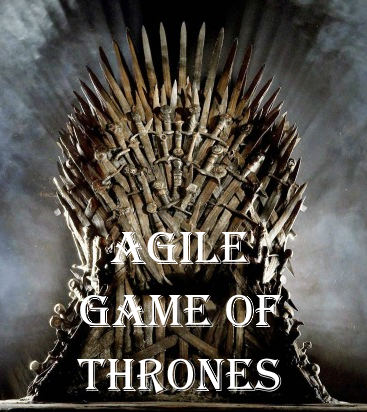

<table><tr><td style="vertical-align: middle"></td></tr></table>

# Atelier Agile Game of Thrones

Agile Game of Thrones est un atelier de sensibilisation à l'agilité. 

## Objectifs de l'atelier

Il met en évidence de manière ludique les enjeux de l'approche agile: Itérations, priorisation, valeur, adaptation aux changements, etc.
Il s'adresse à un public très large débutant ou expérimenté.

### Format

- Durée : Cet atelier se déroule sur une durée de 60 à 75 min
- Nombre de participants : entre 5 et 20 (Observateurs possibles)

## Supports

- Le déroulement complet
- Les instructions pour les participants
- <a href="supports/BBL Agile Game of Thrones.docx">La fiche de jeu</a> pour les participants


## Licence

Agile Game of Thrones de Mael Morel et Romain Schlick est mis à disposition selon les termes de la licence [Creative Commons](https://creativecommons.org/licenses/by-nc-sa/4.0/) - Pas d’Utilisation Commerciale - Partage dans les Mêmes Conditions International 4.0 (CC BY-NC-SA 4.0). "Game of Thrones" est une série déposée par HBO (Home Box Office Inc.). Cet atelier pédagogique n'utilise pas l'image de "Game of Thrones" à des fins commerciaux. 


### Markdown

Markdown is a lightweight and easy-to-use syntax for styling your writing. It includes conventions for

```markdown
Syntax highlighted code block

# Header 1
## Header 2
### Header 3

- Bulleted
- List

1. Numbered
2. List

**Bold** and _Italic_ and `Code` text

[Link](url) and 
```

For more details see [GitHub Flavored Markdown](https://guides.github.com/features/mastering-markdown/).

### Jekyll Themes

Your Pages site will use the layout and styles from the Jekyll theme you have selected in your [repository settings](https://github.com/rschlick/agilegameofthrones/settings). The name of this theme is saved in the Jekyll `_config.yml` configuration file.

